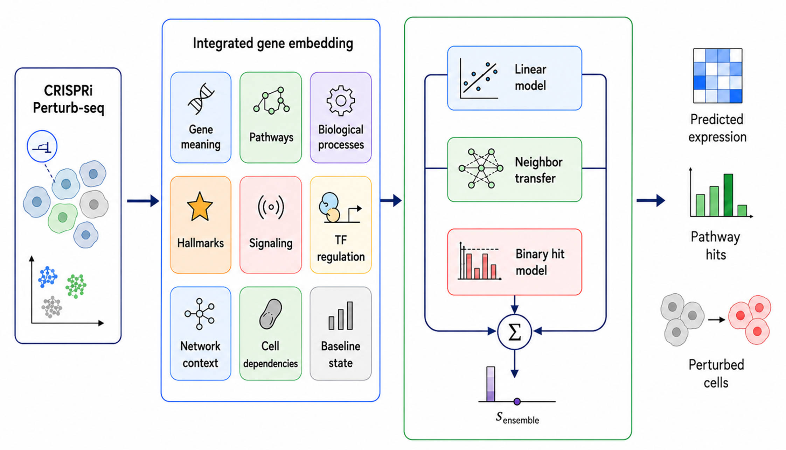

# TusoPerturb

TusoPerturb is a research Python package for predicting transcriptional responses to genetic perturbations. It combines gene embeddings and curated biological annotations with a shared prediction framework for CellSimBench, scPerturBench, PerturbHD, and Systema.



## Overview

Each supported workflow follows the same basic path: build a feature matrix for the perturbations, select a benchmark configuration, run [`head_predict`](tusoperturb/predictor.py), and format the result for the corresponding scorer.

The repository includes static reference features from Reactome, Gene Ontology, MSigDB Hallmark, PROGENy, CollecTRI, STRING, and DepMap. Benchmark datasets, precomputed dataset stages, and upstream scoring harnesses are not bundled with the package.

## Installation

TusoPerturb requires Python 3.11 or newer. From the repository root:

```bash
python -m venv .venv
source .venv/bin/activate
python -m pip install --upgrade pip
python -m pip install -e .
```

An editable install is recommended because the reference data lives in [`data/embeddings/`](data/embeddings/) at the repository root. A non-editable installation must be given explicit reference-data paths through the environment variables described below.

## Quick start

### Systema

The Systema wrapper builds its feature matrix from the bundled reference data. It expects a `PanelMaster` object from the Systema benchmark harness:

```python
from tusoperturb import predict_systema

Y_test = predict_systema(panel_master, seed=1)
```

`panel_master` must provide `all_perts`, `train_perts`, `test_perts`, and `Y_train_post`. A `donor_id` attribute is used when available. The returned array has one row per test perturbation and one column per gene.

### CellSimBench and scPerturBench

The expression-response wrapper returns benchmark-compatible predictions in an `AnnData` object:

```python
import anndata as ad
from tusoperturb import predict_regression

master = ad.read_h5ad("/path/to/nadig25hepg2.h5ad")

pred_adata = predict_regression(
    master,
    dataset="nadig25hepg2",
    seed=1,
    head="cellsim",
)
```

This path also requires the staged dataset cache and external `perturb_2026` package described in [Data requirements](#data-requirements).

## Supported benchmarks

| Benchmark | API | Output | Setup guide |
|---|---|---|---|
| CellSimBench | `predict_regression(..., head="cellsim")` | `AnnData` | [cellsim.md](docs/benchmarks/cellsim.md) |
| scPerturBench | `predict_regression(..., head="scperturb")` | `AnnData` | [scperturb.md](docs/benchmarks/scperturb.md) |
| PerturbHD regression | `predict_regression_gene(...)` | `DataFrame` with `pert`, `gene`, and `effect` | [perturbhd_reg.md](docs/benchmarks/perturbhd_reg.md) |
| PerturbHD hit prediction | `predict_hit(...)` | `DataFrame` with `pert`, `pheno`, and `hit_score` | [perturbhd_hit.md](docs/benchmarks/perturbhd_hit.md) |
| Systema | `predict_systema(...)` | `numpy.ndarray` | [systema.md](docs/benchmarks/systema.md) |

The low-level predictor can also be used directly with a prepared feature matrix:

```python
from tusoperturb import HEAD_CONFIGS, head_predict

Y_pred = head_predict(E, train_idx, Y_train, HEAD_CONFIGS["cellsim"])
```

The public package exports are listed in [`tusoperturb/__init__.py`](tusoperturb/__init__.py).

## Data requirements

The following assets are included in the repository:

- pathway, regulatory, and network references under [`data/embeddings/ref/`](data/embeddings/ref/);
- cell-line-specific DepMap features under [`data/embeddings/depmap_essentiality/`](data/embeddings/depmap_essentiality/).

The CellSimBench, scPerturBench, and PerturbHD wrappers additionally require:

- the benchmark master `.h5ad` files;
- a staged cache for each dataset containing the GenePT features, training targets, perturbation metadata, and control baseline;
- the external `perturb_2026` package, which provides the stage loader and output-shaping utilities;
- PerturbHD AUCell mean-effect parquet files when using `predict_hit`.

Supported staged-dataset identifiers are `nadig25hepg2`, `nadig25jurkat`, `replogle22k562`, and `replogle22rpe1`.

The Systema wrapper does not use the `perturb_2026` stage loader. It requires a `PanelMaster` produced by the Systema benchmark harness.

## Configuration

The following environment variables override the default data locations:

| Variable | Description |
|---|---|
| `TUSOPERTURB_REF_DIR` | Directory containing the pathway, regulatory, and STRING reference files. Defaults to `data/embeddings/ref/` in a source checkout. |
| `TUSOPERTURB_DEPMAP_DIR` | Directory containing the cell-line DepMap parquet files. Defaults to `data/embeddings/depmap_essentiality/` in a source checkout. |
| `TUSOPERTURB_MEAN_EFFECT_DIR` | Directory containing the PerturbHD AUCell mean-effect parquet files used by `predict_hit`. |

## Model

For CellSimBench, scPerturBench, and PerturbHD, TusoPerturb builds an 11,680-dimensional representation for each perturbation from GenePT, Reactome, GO Biological Process, MSigDB Hallmark, PROGENy, CollecTRI, STRING, DepMap, and baseline-expression features.

Systema uses an 8,604-dimensional representation built from the same static biological resources, without the GenePT and baseline blocks. Multi-gene perturbations are combined within each feature block using block-appropriate sum or mean operations.

A benchmark configuration determines the feature subset, scaling, block weights, target transformation, and prediction arms. Depending on the task, the model uses ridge regression alone or a blend of ridge regression, nearest-neighbor target transfer, and a binary-response ridge model. Configurations are defined in [`tusoperturb/heads.py`](tusoperturb/heads.py) and exposed through `HEAD_CONFIGS`.

See [`ARCHITECTURE.md`](ARCHITECTURE.md) for the full feature layout and model details.

## Repository layout

```text
tusoperturb/              Python package and prediction API
data/embeddings/          Bundled biological reference features
docs/benchmarks/          Benchmark-specific setup and scoring guides
scripts/gen_embeddings/   Scripts for regenerating embedding assets
ARCHITECTURE.md           Model and feature-stack documentation
REPRODUCE.md              Reproduction and validation notes
```

## Documentation

- [Model architecture](ARCHITECTURE.md)
- [Benchmark setup guides](docs/benchmarks/README.md)
- [Reproduction guide](REPRODUCE.md)
- [Embedding generation](scripts/gen_embeddings/README.md)

## Citation

When using TusoPerturb, cite the benchmark datasets and biological resources relevant to your experiment. Provenance for the bundled reference assets is documented in [`scripts/gen_embeddings/README.md`](scripts/gen_embeddings/README.md) and the manifest files under [`data/embeddings/ref/`](data/embeddings/ref/).

## License

TusoPerturb is released under the [MIT License](LICENSE).
