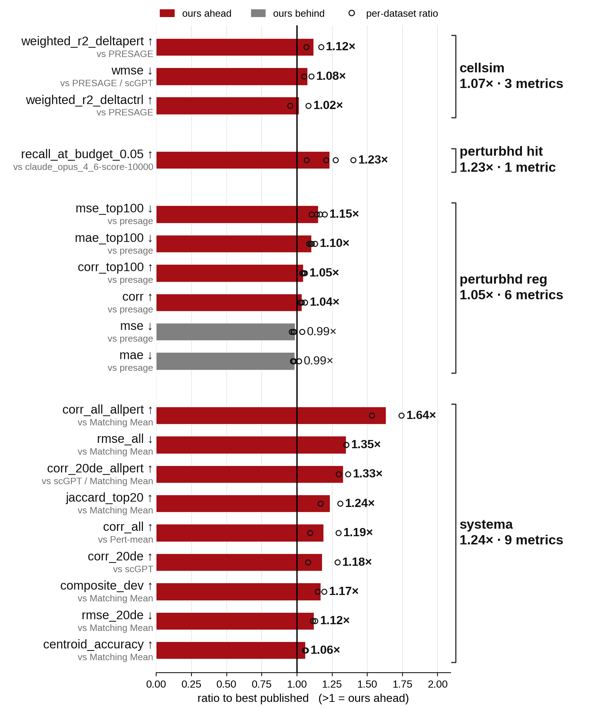

# TusoPerturb


TusoPerturb is a research Python package for predicting transcriptional responses to genetic perturbations. It combines curated biological annotations with a co-essentiality basis derived from DepMap, and serves CellSimBench, scPerturBench, PerturbHD, and Systema through one prediction framework.

Version 2 replaces the per-benchmark configurations of version 1 with **one feature space and two heads**. The public API is unchanged.

## What changed in v2

| | v1.0.0 | v2.0.0 |
|---|---|---|
| Feature space | 11,680-D (GenePT + annotations + baseline) for three benchmarks, 8,604-D for Systema, 8,608-D for hit prediction | one 8,700-D space for all five keys |
| Language-model embeddings | 3,072-D GenePT block | none |
| Perturbation-similarity signal | none | 96 co-essentiality columns from DepMap CRISPR gene effect |
| Configurations | five per-benchmark configs, three distinct objects | two `HeadConfig` objects |
| Block weights | `go_bp × 0.67`, `string × 1.5`, `depmap × 10.0` | none |
| External API keys required | OpenAI, for the GenePT block | none |

The 8,700-D space is the seven annotation blocks (8,604 columns) with the co-essentiality blocks appended (96 columns). Dropping GenePT removes the only component that required a paid external service and the only one that could not be regenerated from public files bundled or scripted in this repository.



## Overview

Every workflow follows the same path: build a feature matrix for the perturbations, select a head, run [`head_predict`](tusoperturb/predictor.py), and format the result for the corresponding scorer.

The repository includes static reference features from Reactome, Gene Ontology, MSigDB Hallmark, PROGENy, CollecTRI, STRING, and DepMap, plus the co-essentiality basis. Benchmark datasets, precomputed dataset stages, and upstream scoring harnesses are not bundled.

## Installation

TusoPerturb requires Python 3.11 or newer. From the repository root:

```bash
python -m venv .venv
source .venv/bin/activate
python -m pip install --upgrade pip
python -m pip install -e .
```

An editable install is recommended because the reference data lives in [`data/embeddings/`](data/embeddings/) at the repository root. A non-editable installation must be given explicit reference-data paths through the environment variables described below.

## Quick start

### Systema

The Systema wrapper builds its feature matrix entirely from bundled data. It expects a `PanelMaster` object from the Systema benchmark harness:

```python
from tusoperturb import predict_systema

Y_test = predict_systema(panel_master, seed=1)
```

`panel_master` must provide `all_perts`, `train_perts`, `test_perts`, and `Y_train_post`. A `donor_id` attribute is used when available. The returned array has one row per test perturbation and one column per gene.

### CellSimBench and scPerturBench

```python
import anndata as ad
from tusoperturb import predict_regression

master = ad.read_h5ad("/path/to/nadig25hepg2.h5ad")

pred_adata = predict_regression(
    master,
    dataset="nadig25hepg2",
    seed=1,
    head="cellsim",
)
```

This path also requires the staged dataset cache and external `perturb_2026` package described in [Data requirements](#data-requirements).

## Supported benchmarks

| Benchmark | API | Output | Setup guide |
|---|---|---|---|
| CellSimBench | `predict_regression(..., head="cellsim")` | `AnnData` | [cellsim.md](docs/benchmarks/cellsim.md) |
| scPerturBench | `predict_regression(..., head="scperturb")` | `AnnData` | [scperturb.md](docs/benchmarks/scperturb.md) |
| PerturbHD regression | `predict_regression_gene(...)` | `DataFrame` with `pert`, `gene`, and `effect` | [perturbhd_reg.md](docs/benchmarks/perturbhd_reg.md) |
| PerturbHD hit prediction | `predict_hit(...)` | `DataFrame` with `pert`, `pheno`, and `hit_score` | [perturbhd_hit.md](docs/benchmarks/perturbhd_hit.md) |
| Systema | `predict_systema(...)` | `numpy.ndarray` | [systema.md](docs/benchmarks/systema.md) |

The low-level predictor can also be used directly with a prepared feature matrix:

```python
from tusoperturb import HEAD_CONFIGS, head_predict

Y_pred = head_predict(E, train_idx, Y_train, HEAD_CONFIGS["cellsim"])
```

The public package exports are listed in [`tusoperturb/__init__.py`](tusoperturb/__init__.py).

## Recorded results

v2 was scored once against a sealed held-out test set and compared cell by cell with the old TusoPerturb.

| Benchmark | Datasets | Metrics | Scored cells | v2 better | old better |
|---|---|---|---|---|---|
| `cellsim` | 4 | 16 | 64 | 54 | 10 |
| `scperturb` | 4 | 3 | 12 | 7 | 5 |
| `perturbhd_reg` | 4 | 6 | 24 | 24 | 0 |
| `perturbhd_hit` | 4 | 2 | 8 | 7 | 1 |
| `systema` | 7 | 8 (+1 not scored) | 56 | 38 | 18 |
| **total** |  |  | **164** | **130** | **34** |

The comparison baseline is the frozen TusoPerturb head table as it stood when the sealed run was executed. For `perturbhd_hit` that is the v1.0.0 configuration unchanged; for the other four keys it is the stronger post-transfer table adopted after a pre-registered 2×2 test, not the weaker v1.0.0 table. This is recorded in `comparison_baseline` in [`champion/params.json`](champion/params.json).

Every scored cell — five benchmarks, 19 dataset instances, 164 benchmark × dataset × metric cells — is stored in [`champion/params.json`](champion/params.json) with both values, the metric direction, and the seed count. Per-benchmark tables are on the pages under [`docs/benchmarks/`](docs/benchmarks/). Seven Systema `composite_dev` cells are recorded but flagged non-scoring and excluded from every count.

Split integrity for the sealed run is documented in [`docs/leakage.md`](docs/leakage.md).

## Data requirements

Included in the repository:

- pathway, regulatory, and network references under [`data/embeddings/ref/`](data/embeddings/ref/);
- cell-line DepMap essentiality features under [`data/embeddings/depmap_essentiality/`](data/embeddings/depmap_essentiality/);
- the co-essentiality basis under [`data/embeddings/coessentiality/`](data/embeddings/coessentiality/).

The CellSimBench, scPerturBench, and PerturbHD wrappers additionally require:

- the benchmark master `.h5ad` files;
- a staged cache for each dataset containing the training targets, perturbation metadata, and control baseline;
- the external `perturb_2026` package, which provides the stage loader and output-shaping utilities;
- PerturbHD AUCell mean-effect Parquet files when using `predict_hit`.

Supported staged-dataset identifiers are `nadig25hepg2`, `nadig25jurkat`, `replogle22k562`, and `replogle22rpe1`.

The Systema wrapper does not use the `perturb_2026` stage loader. It requires a `PanelMaster` produced by the Systema benchmark harness.

## Configuration

| Variable | Description |
|---|---|
| `TUSOPERTURB_REF_DIR` | Directory containing the pathway, regulatory, and STRING reference files. Defaults to `data/embeddings/ref/` in a source checkout. |
| `TUSOPERTURB_DEPMAP_DIR` | Directory containing the cell-line DepMap Parquet files. Defaults to `data/embeddings/depmap_essentiality/` in a source checkout. |
| `TUSOPERTURB_COESS_DIR` | Directory containing the co-essentiality basis. Defaults to `data/embeddings/coessentiality/` in a source checkout. |
| `TUSOPERTURB_MEAN_EFFECT_DIR` | Directory containing the PerturbHD AUCell mean-effect Parquet files used by `predict_hit`. |

## Model

Each perturbation is one row of an 8,700-dimensional matrix: Reactome, GO Biological Process, MSigDB Hallmark, PROGENy, CollecTRI, STRING, and DepMap features (8,604 columns) followed by rank-64 and rank-32 co-essentiality coordinates (96 columns). Multi-gene perturbations are combined within each block using block-appropriate sum or mean operations.

Both heads read every column. Prediction blends a ridge model, a weighted nearest-neighbour target transfer, and a binary-response ridge model. The two heads differ only in head parameters — never in the feature space — and `heads.assert_two_head()` ships as the executable form of that claim.

See [`ARCHITECTURE.md`](ARCHITECTURE.md) for the full feature layout and prediction pipeline.

## Repository layout

```text
tusoperturb/              Python package and prediction API
data/embeddings/          Bundled biological reference features
docs/benchmarks/          Benchmark-specific setup, scoring, and results
docs/leakage.md           Split-integrity audit of the sealed run
scripts/gen_embeddings/   Script for rebuilding the co-essentiality basis
champion/params.json      Frozen configuration and recorded results
ARCHITECTURE.md           Model and feature-stack documentation
REPRODUCE.md              Reproduction and validation notes
```

## Documentation

- [Model architecture](ARCHITECTURE.md)
- [Benchmark setup guides](docs/benchmarks/README.md)
- [Reproduction guide](REPRODUCE.md)
- [Split-integrity audit](docs/leakage.md)
- [Co-essentiality basis generation](scripts/gen_embeddings/README.md)

## Citation

When using TusoPerturb, cite the benchmark datasets and biological resources relevant to your experiment. Provenance for the bundled reference assets is documented in [`scripts/gen_embeddings/README.md`](scripts/gen_embeddings/README.md) and the manifest files under [`data/embeddings/ref/`](data/embeddings/ref/).

## License

TusoPerturb is released under the [MIT License](LICENSE).
